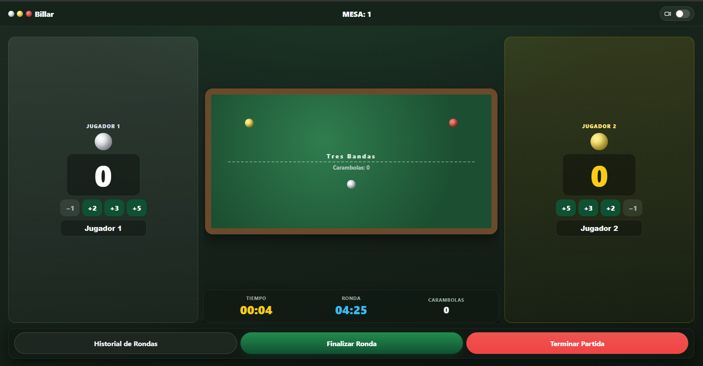
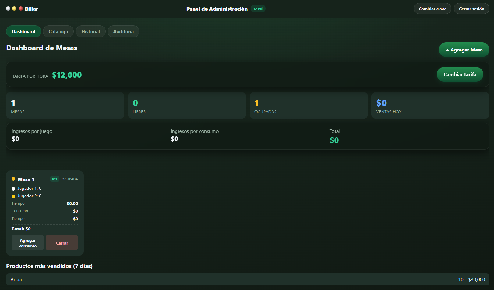

# Billiard System

A real-time billiard hall management platform built with Angular and .NET. Manage tables, track sessions, score games, handle consumptions, and monitor your business from a single dashboard.


---

## Features

| Module | Description |
|--------|-------------|
| **Dashboard** | Live table overview, daily sales, top products, table status at a glance |
| **Table Management** | Create, edit, enable/disable tables with unique codes and hourly rates |
| **Game Sessions** | Start, score, rename players, finish sessions with automatic billing |
| **Rounds** | Track rounds within a match with winner detection |
| **Consumption** | Add products to active sessions with real-time total updates |
| **Waiter/Check Calls** | Players request service or the check from the table UI |
| **Camera Replay** | Circular video buffer for instant replay on each table |
| **Catalog** | Manage products and categories |
| **History** | Full match history with filters |
| **Audit Log** | Track every action with user, timestamp, and details |
| **Admin Auth** | Token-based authentication with 30-day sessions and PBKDF2 hashing |
| **Real-time** | Instant updates across all devices via SignalR WebSockets |

---

## Tech Stack

- **Frontend**: [Angular 22](https://angular.dev/) (standalone components, signals, lazy routes)
- **Backend**: [.NET 10](https://dotnet.microsoft.com/) Minimal API with Clean Architecture
- **Database**: PostgreSQL via Entity Framework Core
- **Real-time**: [SignalR](https://learn.microsoft.com/aspnet/core/signalr/) WebSockets
- **Auth**: Custom opaque token sessions with PBKDF2 password hashing
- **CI/CD**: GitHub Actions (build on VPS via deploy.sh)
- **Deployment**: Docker + Nginx reverse proxy on VPS

---

## Architecture

```
                    Internet
                       │
            vps-gateway (nginx, 80/443)
                       │ billard-net (external)
                       ▼
┌──────────────────────────────────────┐
│   billard (app)                      │
│   ── billard-net (shared, gateway)   │
│   ── billard-internal-net (internal) │
│         └── db (postgres, aislada)   │
└──────────────────────────────────────┘
```

The Angular frontend and the .NET backend are packaged into a single image (`billard`). The Postgres DB lives on an internal network (`internal: true`) and only the app can reach it.

```
Frontend (Angular)          Backend (.NET)
┌─────────────────┐        ┌─────────────────────┐
│  SPA + Router   │──API──▶│  Minimal API         │
│  SignalR Client │◀─WS────│  SignalR Hub         │
│  Auth Interceptor│       │  Auth Middleware      │
│  Offline Queue  │        │  Rate Limiting       │
└─────────────────┘        │  EF Core + Postgres  │
                           └─────────────────────┘
```

---

## Project Structure

```
Billard-system/
├── backend/
│   └── src/
│       ├── BilliardSystem.API/           # Endpoints, Hubs, Auth
│       ├── BilliardSystem.Application/   # Abstractions, Services
│       ├── BilliardSystem.Domain/        # Entities, Enums, Events
│       └── BilliardSystem.Infrastructure/# Persistence, DI
├── frontend/
│   └── src/app/
│       ├── core/          # Auth, API, SignalR, Models
│       ├── features/      # Admin, Player, Catalog, History, Audit
│       └── shared/        # Reusable components
├── deploy/                # Nginx config, deployment guide
├── ai-context/            # Project documentation
├── Dockerfile             # Multi-stage build
└── docker-compose.yml     # Container orchestration
```

---

## Getting Started

### Requisitos

- [Docker Desktop](https://docs.docker.com/get-docker/) (corriendo)
- [.NET 10 SDK](https://dotnet.microsoft.com/download/dotnet/10.0)
- [Node.js 22+](https://nodejs.org/)
- Copiar `.env.example` → `.env` y configurar `POSTGRES_PASSWORD`, `JWT_KEY`, `SUPER_USERNAME`, `SUPER_PASSWORD`

La DB (Postgres) siempre vive en Docker. Hay **2 flujos** para correr la app:

---

### Flujo A — Todo en Docker (como producción)

```bash
docker compose -f docker-compose.yml -f docker-compose.local.yml up -d --build
```

- **App:** http://localhost:5000
- **Health:** http://localhost:5000/api/health
- **DB:** 127.0.0.1:5433 (solo loopback)
- **Datos:** persisten en el volumen `billard-pg` al apagar; solo se borran con `down -v`

```bash
# Detener
docker compose -f docker-compose.yml -f docker-compose.local.yml down

# Borrar DB y empezar de cero (volumen eliminado)
docker compose -f docker-compose.yml -f docker-compose.local.yml down -v
docker compose -f docker-compose.yml -f docker-compose.local.yml up -d --build
```

---

### Flujo B — Desarrollo local (DB en Docker, hot reload)

```bash
# 1) Levantar solo la DB
docker compose -f docker-compose.yml -f docker-compose.local.yml up -d db

# 2) Backend (terminal 1)
cd backend/src/BilliardSystem.API
dotnet run
# → http://localhost:5000

# 3) Frontend (terminal 2)
cd frontend
npm start
# → http://localhost:4200 (proxy /api a :5000)
```

> **Nota:** Si venís del Flujo A, primero detené el contenedor `billard` (ocupa el 5000):
> ```bash
> docker stop billard
> ```

---

### Default Login

- URL: `http://localhost:4200/#/login`
- Password: `admin`
- Se pide cambiar la clave en el primer ingreso (mín. 8 caracteres)

---

### Gotchas

| Problema | Causa | Solución |
|----------|-------|----------|
| `dotnet run` → connection refused en 5433 | Se usó `docker compose up` sin los dos `-f` | SIEMPRE usar `docker compose -f docker-compose.yml -f docker-compose.local.yml` |
| `dotnet run` → puerto 5000 ocupado | El contenedor `billard` (Flujo A) sigue corriendo | `docker stop billard` |
| El 5433 ya está ocupado | Otro proyecto local (en `C:\Dev`) usa Postgres en 5433 | Detener ese proyecto antes |
| Password auth failed para postgres | El volumen tiene un password distinto al `.env` | `docker compose ... down -v` + `up -d` (borra datos) |

---

### Migraciones

Billard aplica migraciones automáticamente al arrancar el backend (migrator integrado en `DatabaseInitializer`). No hace falta un paso extra.

```bash
# Crear una migración
cd backend
dotnet ef migrations add NombreMigracion \
  --project src/BilliardSystem.Infrastructure \
  --startup-project src/BilliardSystem.API

# Se aplica sola al próximo `dotnet run` o al reiniciar el contenedor
```

Verificar migraciones aplicadas:
```bash
docker exec -e PGPASSWORD=postgres billard-db-1 psql -U postgres -d billiard \
  -c "SELECT \"MigrationId\" FROM \"__EFMigrationsHistory\" ORDER BY 1;"
```

---

## Deployment

Deploys happen automatically on push to `main` via GitHub Actions. For VPS setup and manual deploy commands, see [deploy/DEPLOY.md](deploy/DEPLOY.md).

---

## Screenshots

<!-- Add your screenshots here -->
<!--  -->
<!--  -->
<!--  -->

---

## Security

- **PBKDF2** password hashing with 100k iterations and random salt
- **Opaque session tokens** (32 bytes, SHA-256 hashed in DB, 30-day sliding expiry)
- **Rate limiting** on login (5 req/min) and API (60 req/min)
- **Server-side validation** on all inputs (quantity, score, names, rates)
- **Admin endpoints protected** — player/kiosk endpoints remain anonymous
- **Security headers** (CSP, HSTS, nosniff, frame-ancestors)
- **Forwarded headers** for correct IP behind reverse proxy

---

## API Endpoints

| Method | Path | Auth | Description |
|--------|------|------|-------------|
| POST | `/api/auth/login` | Public | Login (rate-limited) |
| POST | `/api/auth/logout` | Admin | Revoke session |
| POST | `/api/auth/change-password` | Admin | Change password + revoke all sessions |
| GET | `/api/tables` | Public | List all tables |
| POST | `/api/tables` | Admin | Create table |
| PUT | `/api/tables/{id}` | Admin | Update table |
| POST | `/api/tables/{id}/start` | Public | Start session |
| POST | `/api/tables/{id}/score` | Public | Add score |
| POST | `/api/tables/{id}/finish` | Public | Finish session |
| POST | `/api/tables/{id}/consumption` | Public | Add consumption |
| GET | `/api/dashboard/summary` | Admin | Daily summary |
| GET | `/api/audit/logs` | Admin | Audit trail |

---

## AI Context

[ai-context/](ai-context/) is the canonical project context for AI-assisted work (architecture snapshot, specs, agents, and skills).

---

## To Do

- [X] Free-play mode: remove the "Cerrar" button from the "Partida terminada" modal — closing it leaves a blank screen.
- [X] Audit log: stop logging waiter calls and check requests. Only log session end, catalog modifications, table creation, table disable/delete, and price-per-hour changes.
