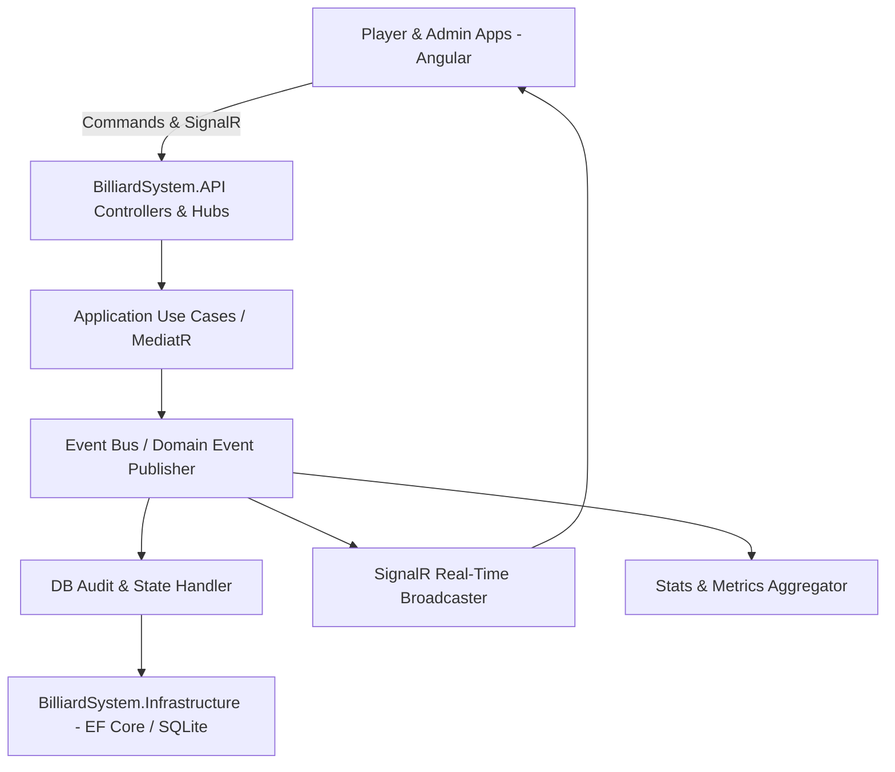

# Plan de Arquitectura e Implementación: Sistema de Administración de Mesas de Billar Tres Bandas (V3 - Con Documentación AI)

Este documento presenta el diseño de software profesional, arquitectura limpia y plan de implementación detallado para el **Sistema de Administración de Mesas de Billar Tres Bandas**, incorporando el sistema de documentación técnica incremental para IA en `/ai-content`, auditoría, arquitectura orientada a eventos (Event Bus), resiliencia offline, catálogo dinámico de productos, dashboard administrativo, buffer de video configurable y soporte para desarrollo/producción.

---

## 1. Documentación Técnica Incremental para IA (`/ai-content`)

Todo el proyecto contará con una carpeta de contexto vivo en la raíz de la solución: `c:\Dev\Billard-system\ai-content`. Esta documentación se mantendrá actualizada continuamente con cada avance para permitir que cualquier sesión de IA o desarrollador continúe el proyecto sin perder contexto.

```
/ai-content
├── 00-project-overview.md
├── 01-architecture.md
├── 02-tech-stack.md
├── 03-folder-structure.md
├── 04-database.md
├── 05-api-endpoints.md
├── 06-signalr-events.md
├── 07-domain-events.md
├── 08-business-rules.md
├── 09-authentication.md
├── 10-video-buffer.md
├── 11-testing.md
├── 12-deployment.md
├── 13-roadmap.md
├── 14-known-issues.md
├── 15-decisions-log.md
└── progress.md
```

---

## 2. Modos de Ejecución del Sistema

1. **Modo Desarrollo (Dev Mode)**:
   - **Frontend (Angular 19+)**: Ejecutándose de forma independiente con `ng serve` (puerto 4200) con Hot-Reload y Proxy (`proxy.conf.json`) hacia la API.
   - **Backend (.NET API)**: Ejecutándose en `http://localhost:5000` con CORS habilitado para `localhost:4200` y Swagger UI habilitado.
2. **Modo Producción (Prod Mode - "Single Binary Launch")**:
   - La aplicación Angular se compila a archivos estáticos (`dist/billiard-frontend/browser`).
   - El proyecto ASP.NET Core API sirve los archivos estáticos mediante middleware `UseStaticFiles()` y fallback SPA routing (`MapFallbackToFile("index.html")`).
   - **Resultado**: El cliente ejecuta una sola aplicación `.exe` en Windows y todo funciona sin instalar Node.js ni IIS.

---

## 3. Arquitectura de Software: Clean Architecture + Event-Driven (Event Bus)



### Domain Events
`SessionStartedEvent`, `PlayerScoredEvent`, `PlayerNameChangedEvent`, `ConsumptionAddedEvent`, `WaiterRequestedEvent`, `CheckRequestedEvent`, `ReplayRequestedEvent`, `SessionEndedEvent`, `AuditLoggedEvent`.

---

## 4. Módulos Clave del Sistema

1. **Configuración Global**: Tarifas por defecto, duración de buffer de replay (30s a 5m), calidad de video, branding (nombre, logo, colores, idioma), catálogo de productos y mesas.
2. **Usuarios, Roles y Auditoría**: Roles `Administrador` y `Empleado`. Auditoría de cada acción (`AuditLogs`).
3. **Dashboard Administrativo**: KPIs en vivo (mesas libres/ocupadas, total ventas hoy, tiempo promedio), gráfica de productos más vendidos y monitor de mesas.
4. **Resiliencia Offline**: Cola de comandos en `IndexedDB`/`LocalStorage` con deduplicación por GUID al restablecer conexión SignalR.
5. **Historial Enriquecido**: Guardado completo con versión del sistema, quien cerró la partida, carambolas totales, desglose de tiempo y consumos.
6. **Buffer Circular Configurable**: Retención en memoria RAM de fragmentos de video (30s a 5m) sin interrumpir la grabación de la cámara USB.

---

## 5. Modelo de Datos (EF Core / SQLite)

Tablas: `Tables`, `Users`, `AuditLogs`, `Settings`, `Categories`, `Products`, `MatchHistories`, `MatchScoreLogs`, `MatchConsumptions`.

---

## 6. Plan de Trabajo e Implementación por Fases

### Fase 0: Inicialización & Estructuración de Documentación IA (`/ai-content`)
- [ ] Crear la estructura inicial completa de la carpeta `ai-content/` (00 al 15 + progress.md).
- [ ] Registrar las decisiones iniciales en `15-decisions-log.md` y establecer `progress.md`.

### Fase 1: Backend Architecture, Event Bus & Base de Datos (.NET 8/9)
- [ ] Solución .NET en 4 proyectos (`Domain`, `Application`, `Infrastructure`, `API`).
- [ ] Implementar Event Bus interno y Domain Events.
- [ ] EF Core + SQLite con entidades de Auditoría, Configuración, Historial Enriquecido y Catálogo.
- [ ] SignalR Hub (`TableHub`) para broadcast en tiempo real.
- [ ] Controladores REST (Auth, Tables, Products, Matches, Settings, Audit, Dashboard).
- [ ] Actualización de documentación en `/ai-content`.

### Fase 2: Frontend Angular (19+) Dev/Prod & Módulos
- [ ] Proyecto Angular con Standalone Components, Signals, RxJS y Proxy de desarrollo.
- [ ] **Player App**: Marcador de 3 bandas (Blanco/Amarillo), cronómetro reactivo, lista de consumos, campana y pedido de cuenta.
- [ ] **Cámara & Replay Configurable**: Buffer circular de 30s a 5m sin parar la grabación.
- [ ] **Modo Libre**: Long-Press (3s) + Modal Slide to Confirm.
- [ ] **Resiliencia Offline**: Client Command Queue con deduplicación por Transaction GUID.
- [ ] **Admin App & Dashboard**: Grid de mesas, métricas en vivo, catálogo de productos, gestión de usuarios, visor de auditoría.
- [ ] **Historial Enriquecido**: Consulta con detalle completo.
- [ ] Actualización de documentación en `/ai-content`.

### Fase 3: Pruebas Automatizadas, Empaquetado Prod & Cierre
- [ ] Pruebas unitarias backend (xUnit) y frontend (Jasmine).
- [ ] Configurar build en modo producción (Servidor SPA `.exe`).
- [ ] Actualización final de `/ai-content` (`progress.md`, `testing.md`, `deployment.md`).
